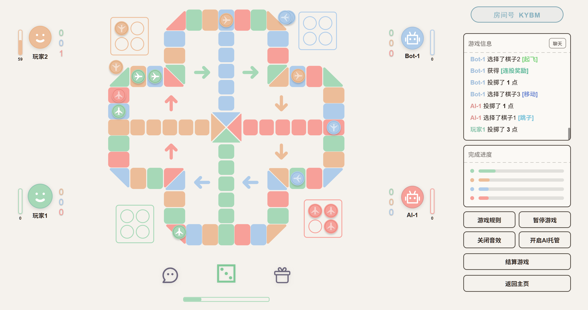

<p align="center">
  
</p>

<p align="center">
  <b>一款由ZTMYO个人开发的极简风格、高颜值的网页飞行棋游戏。</b>
</p>

<p align="center">
  <a href="https://chess.shiliu.space/">
    
  </a>
</p>

<p align="center">
  
  <p align="center">游戏预览</p>
</p>

---

### 核心特性

#### 三大游戏模式
- **在线联机**：基于 WebSocket 实现的实时对战。支持创建私密/公开房间，具备完整的房间管理系统。玩家可以在局内发送表情互动、实时文字聊天。
- **人机对战**：内置智能 AI 算法。提供“简单”与“困难”两级难度，困难 AI 会分析场上局势（如击败概率、终点距离等）进行决策。支持随时开启/关闭 AI 托管。
- **本地多人**：支持 2-4 人在同一设备上进行游戏，适合线下好友聚会，完全不依赖网络连接。

#### 创新道具模式
在道具模式下，击败对手棋子可获得积分。积攒积分可兑换以下四大强力道具，极大增加了游戏的策略深度：
- **盲盒**：随机补给道具，在积分不足时可能成为逆转局势的关键。
- **传送门**：将棋子随机传送到地图上的空位置，可能瞬间直达终点，也可能面临倒退风险。
- **多面骰子**：突破传统 6 点限制，随机投掷出 1-12 点，实现超远距离跨越。
- **遥控骰子**：允许玩家自由选择下一次投掷的 1-6 任意点数，精准实现击败或占领关键格。
#### 实时观战
- **观战模式**：支持通过房间列表直接进入正在进行的对局，以“上帝视角”实时观摩场上战况。
#### 深度数据分析与成就
- **过程统计**：实时记录每位玩家的移动距离、击败次数、投掷点数等情况。
- **趋势分析**：游戏结束后，通过折线图展示各玩家的完成度演变趋势，复盘整局局势。
- **称号系统**：根据单局表现授予称号。如击败次数最多的“收割者”、首个抵达终点的“最速传说”等。

#### 移动端深度优化
- **触控优化**：移除了移动端浏览器原生的 300ms 点击延迟，确保操作反馈如丝般顺滑。
- **响应式布局**：界面针对不同屏幕尺寸进行适配，在手机浏览器上自动调整 UI 元素大小，保证操作便捷性。

---

### 技术亮点

- **高性能渲染**：大量使用 SVG 矢量图形绘制棋盘与棋子，配合 CSS3 滤镜（feGaussianBlur）实现霓虹发光效果，在保证高颜值的同时兼顾渲染性能。
- **硬件加速**：关键 UI 组件开启 GPU 合成加速，减少移动端 CPU 负载，解决交互滞后感。
- **轻量级后端架构**：
  - **无数据库设计**：所有实时对战状态、房间信息及游戏数据均通过 Node.js 内存管理，极大地降低了服务器部署成本与维护复杂度。
  - **高可用重连机制**：严密的掉线处理逻辑，支持玩家意外断线后的快速重连。重连后可瞬间恢复游戏数据。
  - **智能 AI 接管系统**：玩家离线或思考超时时自动切换至 AI 托管，确保对局不因个别玩家的行为而中断。
  - **物理隔断与迁移优化**：支持玩家在不同房间/游戏间静默迁移。通过底层的“物理隔断”清理技术，杜绝了房间切换时的消息泄漏与会话冲突。
  - **WebSocket 状态同步**：基于 WebSocket 实现极低延迟的双向通信，确保多人联机时的实时性与同步一致性。
- **纯粹技术栈**：前端不依赖任何重量级框架，使用原生 JavaScript (ES6+)、CSS 变量和标准 Web API 开发，具有极高的运行效率和兼容性。

---

### 快速开始

#### 1. 环境准备
确保你的环境中安装了 [Node.js](https://nodejs.org/)。

#### 2. 克隆与安装
```bash
git clone https://github.com/ZTMYO/MinimalistAeroplaneChess
cd minimalist-aeroplane-chess

# 安装前端依赖
cd frontend && npm install

# 安装后端依赖
cd ../backend && npm install
```

#### 3. 运行项目
```bash
# 启动 WebSocket 后端
cd backend && node server.cjs

# 启动前端开发服务器 (Vite)
cd ../frontend && npm run dev
```

---

### 致谢与灵感

本项目在开发过程中，深受 [Hullqin 的桌游合集](https://game.hullqin.cn/) 的启发，在此表示由衷的感谢。
本项目在游戏规则的设计上，参考了[飞行棋百度百科](https://baike.baidu.com/item/%E9%A3%9E%E8%A1%8C%E6%A3%8B)的启发，在此表示由衷的感谢。

---

### 开源协议

本项目基于 **MIT License** 开源。欢迎 Star 与 Fork！

<p align="center">Made with ❤️ by ZTMYO</p>
